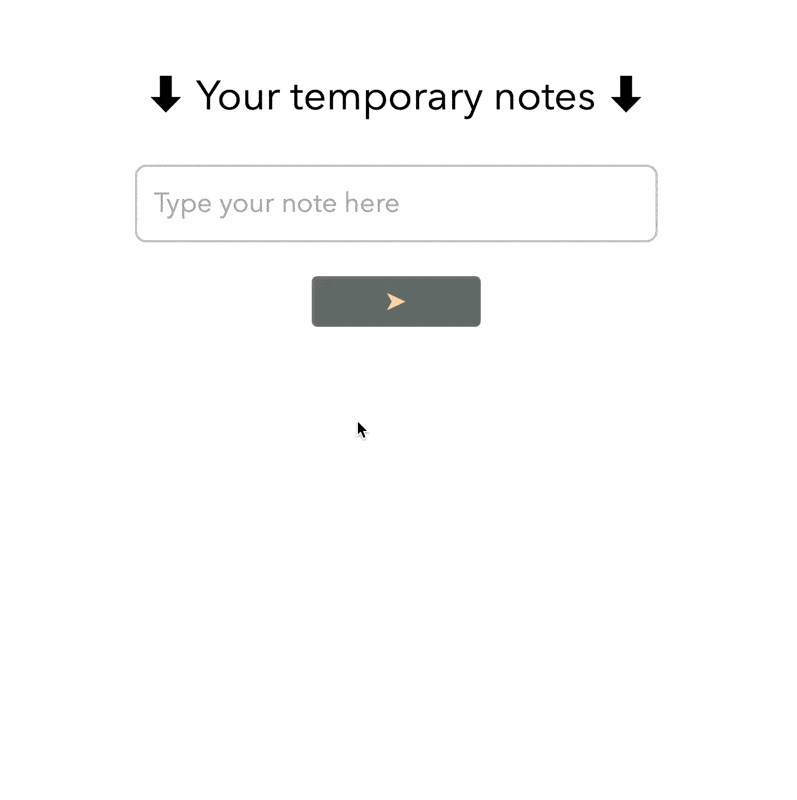

# 📝 NoteBin
NoteBin is a simple temporary note-taking app built with **Angular** and **TypeScript**. It was created to practice using Angular pipes, services, and component interactions.

# 📸 Demo
Check out how it works:

#### Built as a fun project to explore Angular! 😊
